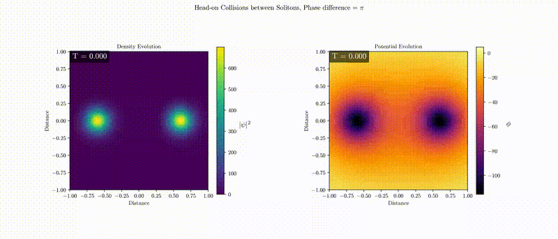

NOT UPTATED...CONTACT ME FOR THE MOST RECENT VERSION

# cuULDM

GPU (CUDA) simulator for ultralight dark matter (ULDM) dynamics based on the Schrödinger–Poisson system.  
Implements a 3D pseudo-spectral solver with split-step (Strang splitting) integration and Poisson equation solved in Fourier space.

## Demo



## ✨ Features

- Numerical evolution of the Schrödinger–Poisson equations:␣␣
  i ∂ψ/∂t = -(1/2) ∇²ψ + φ ψ␣␣
  ∇²φ   = 4 π |ψ|²
- **Pseudo-spectral method** using 3D FFTs (cuFFT).  
- **Split-step scheme** (half-step potential + full-step kinetic).  
- Poisson solver in Fourier space.  
- Initialization with **tabulated soliton profile** or optional point-mass contribution.  
- Direct visualization. 

## 🚀 Requirements

- NVIDIA GPU 
- **CUDA Toolkit** (>= 11.x recommended)  
- **cuFFT** (bundled with CUDA Toolkit)  
- `nvcc` compiler  

## ⚙️ Build

Clone the repository and compile with:

```bash
nvcc -O3 -arch=sm_XX cuULDM.cu -lcufft -o cuULDM


